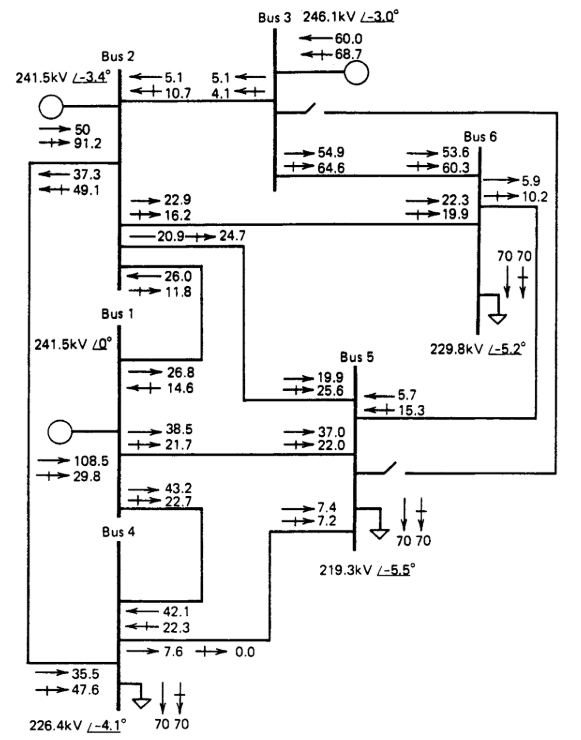

# Actividad-2-Metodos-Computacionales
Calculo de factores de sensibilidad para el flujo DC

**Tarea nro.2: Análisis de Factores de Sensibilidad en Sistemas de Potencia**
*Estimación de cambios en flujos ante variaciones en la generación y contingencias*

Este código implementa un análisis de sensibilidad para sistemas de potencia utilizando el modelo de flujo de potencia DC. Calcula la matriz de susceptancia reducida (Bbus), excluyendo el nodo slack, y usa su inversa o pseudoinversa para determinar factores de sensibilidad como los generation shift factors (α), line outage distribution factors (δ) y otros factores adicionales (β). Estas funciones son útiles para estudiar cómo los cambios en la generación o la pérdida de líneas afectan los flujos de potencia en el sistema.

1. **Factor de Cambio de Generación (Generation Shift Factor)**  
   Este factor estima el cambio en el flujo de una línea ante un cambio en la generación en un bus específico.  
   - **Definición:**  
     $$a_{l,i} = \frac{\Delta f_l}{\Delta P_i}$$  
     donde:  
     - $\Delta f_l$ es el cambio en el flujo de la línea $e$.  
     - $\Delta P_i$ es el cambio en la generación en el bus $i$.  
   - **Aplicación:**  
     Permite calcular el nuevo flujo en una línea tras la pérdida o incremento de generación en un bus:
     $$f_l = f_l^{(0)} + a_{l,i} \cdot \Delta P_i$$

2. **Factor de Distribución de Flujo por Falla de Línea (Line Outage Distribution Factor)**  
   Este factor permite estimar la redistribución de los flujos en la red cuando se desconecta una línea.
   - **Definición:**  
     $$\beta_{l,h} = \frac{\Delta f_l}{\Delta f_h}$$  
     donde:  
     - $\Delta f_l$ es el cambio en el flujo de la línea $l$.
     - $\Delta f_h$ es el cambio en el flujo de la línea $h$.
   - **Aplicación:**  
     Se utiliza para calcular el nuevo flujo en la línea $l$ luego de la desconexión de la línea $h$:
     $$f_l^{(k)} = f_l^{(0)} + \beta_{l,h} \cdot f_k^{(0)}$$

3. **Factor Delta de sensibilidad (δ)**  
   Este factor ajusta la sensibilidad incorporando la compensación necesaria en la red, permitiendo modelar con mayor precisión la redistribución de flujos ante contingencias.  
   - **Definición:**  
     $$\delta_{j,i} = \frac{X_i \cdot \left(W_{k,j} - W_{m,j}\right)}{X_i + \Big(W_{k,k} + W_{m,m} - 2W_{k,m}\Big)}$$  
     donde:  
     - $X_i$ es la reactancia de la línea $i$.  
     - $W$ es la matriz derivada de la inversión o pseudoinversa de la matriz $B_{bus}$ extendida (incluyendo el nodo slack).  
     - $W_{k,j}$ y $W_{m,j}$ representan los elementos de $W$ correspondientes a los nodos “FROM” ($k$) y “TO” ($m$) de la línea, para la perturbación en el bus $j$.  
     - $W_{k,k}$, $W_{m,m}$ y $W_{k,m}$ son los elementos diagonales y cruzados de la matriz $W$.

---

## Metodología General

El proceso para el cálculo de estos factores de sensibilidad se puede resumir en los siguientes pasos:

1. **Construcción de la Matriz \(B_{bus}\) Extendida:**  
   Se parte de la matriz de susceptancia nodal, la cual se deriva de la matriz de admitancia \(Y_{bus}\). Para el flujo DC se omiten las resistencias y cargas shunt, y se excluye la barra slack para garantizar la invertibilidad.

2. **Cálculo de la Matriz \(W\):**  
   Se obtiene la matriz \(W = B_{bus}^{-1}\) (o su pseudoinversa), la cual se utiliza para determinar las variaciones en los ángulos nodales.

3. **Determinación de los Factores de Sensibilidad:**  
   - **Generation Shift Factors:** Se calculan a partir de las diferencias en los elementos de \(W\) para estimar la sensibilidad de los flujos a cambios en la generación.  
   - **Line Outage Distribution Factors:** Se derivan mediante la comparación de los flujos base y las variaciones inducidas por la desconexión de una línea.  
   - **Factor Delta:** Se evalúa utilizando la fórmula indicada, que incorpora tanto la reactancia de la línea como las diferencias en los ángulos (obtenidos de \(W\)) en los nodos extremos de la línea.

4. **Aplicación en Análisis de Contingencias:**  
   Con estos factores se pueden realizar estudios de contingencia en tiempo real, identificando aquellas situaciones en las que la desconexión de una línea o la pérdida de generación provocaría sobrecargas o violaciones de límites en el sistema.

---

## Visualización y Aplicaciones

Los resultados del análisis se pueden visualizar mediante mapas de calor o diagramas unifilares, que ilustren la redistribución de flujos y los cambios en los ángulos nodales ante contingencias. Esto es esencial para la toma de decisiones en la operación en tiempo real y para la optimización del despacho de generación.

*Figura 1: Ejemplo de diagrama que muestra la redistribución de flujos ante la falla de una línea*

---

**Funciones:**

**B_bus:**

*Descripción*

Calcula la matriz de susceptancia reducida (Bbus) del sistema de potencia, excluyendo el nodo slack. Esta matriz es fundamental para los cálculos de flujo de potencia DC y sirve como base para determinar los factores de sensibilidad.

*Requiere*

    - using LinearAlgebra
    - using DataFrames
    - using CSV
    - using Plots

    Entradas:  

    - lines: DataFrame con la información de las líneas del sistema. Contiene columnas como:
    
      - FROM: Nodo de envío.
      - TO: Nodo de recibo.
      - x: Resistencia de la línea.

    - nodes : DataFrame con la información de los nodos. Contiene columnas como:

      - NUMBER: Número del nodo.
      - TYPE: Tipo de nodo (3 indica el nodo slack).

    Salida :    

    - B_bus : Matriz de susceptancia reducida (excluyendo el nodo slack), utilizada en los cálculos de sensibilidad.

**calculo_de_α:**

*Descripción*

Calcula los generation shift factors (α), que indican cómo cambia el flujo en las líneas del sistema ante variaciones en la inyección de potencia en los nodos (excepto el nodo slack, que compensa los cambios).

*Requiere*

    - using LinearAlgebra
    - using DataFrames
    - using CSV
    - using Plots

    Entradas:  

    - lines: DataFrame con la información de las líneas del sistema. Contiene columnas como:
    
      - FROM: Nodo de envío.
      - TO: Nodo de recibo.
      - x: Resistencia de la línea.

    - nodes : DataFrame con la información de los nodos. Contiene columnas como:

      - NUMBER: Número del nodo.
      - TYPE: Tipo de nodo (3 indica el nodo slack).

    - Bbus  : Matriz de susceptancia reducida, obtenida de B_bus.

    Salida :    

    - α : Matriz de tamaño (lineas x nodos) que contiene los generation shift factors.

**calculo_de_δ:**

*Descripción*

Este factor cuantifica la sensibilidad de redistribución de flujos de potencia cuando ocurre una contingencia, permitiendo estimar los nuevos flujos post-contingencia sin necesidad de realizar múltiples flujos de carga.

*Requiere*

    - using LinearAlgebra
    - using DataFrames
    - using CSV
    - using Plots

    Entradas:  

    - lines: DataFrame con la información de las líneas del sistema. Contiene columnas como:
    
      - FROM: Nodo de envío.
      - TO: Nodo de recibo.
      - x: Resistencia de la línea.

    - nodes : DataFrame con la información de los nodos. Contiene columnas como:

      - NUMBER: Número del nodo.
      - TYPE: Tipo de nodo (3 indica el nodo slack).

    - Bbus  : Matriz de susceptancia reducida.

    Salida :    

    - δ : Matriz de factores delta (num_nodes x num_lines) donde cada elemento δ[j,i] representa la sensibilidad del nodo j ante la contingencia de la línea i

**calculo_de_β:**

*Descripción*

Calcula un factor de sensibilidad (β), que representar interacciones entre líneas o efectos combinados de cambios en el sistema.

*Requiere*

    - using LinearAlgebra
    - using DataFrames
    - using CSV
    - using Plots

    Entradas:  

    - lines : DataFrames
    - nodes : DataFrames
    - Bbus  : matriz

    Salida :    

    - β : matriz

